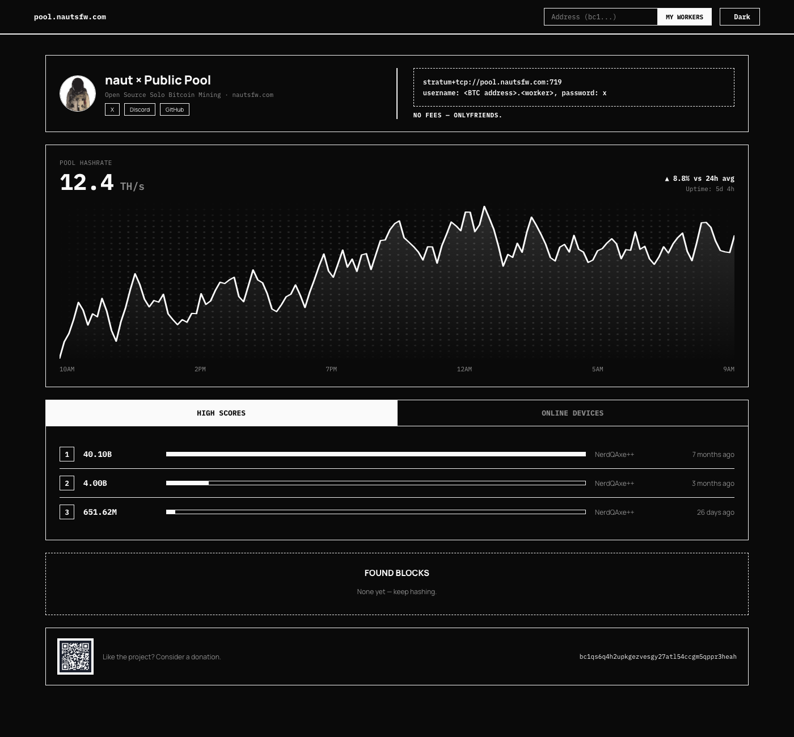

# naut × Public Pool

A static, no-build-step frontend for [Public-Pool](https://github.com/benjamin-wilson/public-pool) — an open-source, solo Bitcoin mining pool. Shows live pool hashrate, high scores, online devices, found blocks, and per-address worker stats, with a light/dark theme toggle.



## How it's built

`site/` holds everything that gets deployed: plain HTML/CSS/JS, no framework, no bundler, no build step.

- **`index.html`** — page shell and topbar
- **`assets/config.js`** — site branding (name, domain, stratum URL, donation address, social links) as plain globals
- **`assets/app.css`** — design tokens (light/dark palettes) and component styles
- **`assets/app.js`** — a small hash-router with three views (dashboard, an address's workers, a single worker's detail) that fetch straight from the Public-Pool REST API (`/api/info`, `/api/pool`, `/api/network`, `/api/client/:address...`)

There's nothing to compile — edit `config.js`/`app.css`/`app.js` directly and reload.

## Running this for your own pool

Edit `site/assets/config.js` — it's the only file with anything specific to this deployment (domain, stratum URL, donation address, social links). Swap `site/assets/avatar.png` for your own image if you want different branding art. Everything else in `site/` is generic.

The exposed port is configurable via a `.env` file (see `.env.example`):

```bash
cp .env.example .env
# edit PORT if 2019 is taken
```

## Dependencies

Requires [Public-Pool](https://github.com/benjamin-wilson/public-pool) to be running somewhere reachable at `/api` (relative to wherever this site is served from). In this deployment, Public-Pool runs on Umbrel and a reverse proxy (Caddy) forwards `/api` to it — see `docker-compose.yml`.

## Local development

Serve `site` with any static file server and point it at a running Public-Pool API on the same origin (e.g. proxy `/api` to your Public-Pool instance), for example:

```bash
cd site
python3 -m http.server 8080
```

Then open `http://localhost:8080`. Without a real `/api` behind it the views will just show their error/empty states.

## Deployment

`docker-compose.yml` runs plain `nginx:1.27-alpine` and bind-mounts `site` over its web root read-only:

```yaml
volumes:
  - "./site:/usr/share/nginx/html:ro"
```

Since the site is a static, hash-routed SPA, no custom nginx config is needed — stock nginx serves it as-is.

```bash
docker compose up -d
```

The site itself doesn't depend on any Public-Pool-UI upstream image or build — only on a reverse proxy (Caddy, in this deployment) forwarding `/api` to a running Public-Pool instance, per [Dependencies](#dependencies) above.
